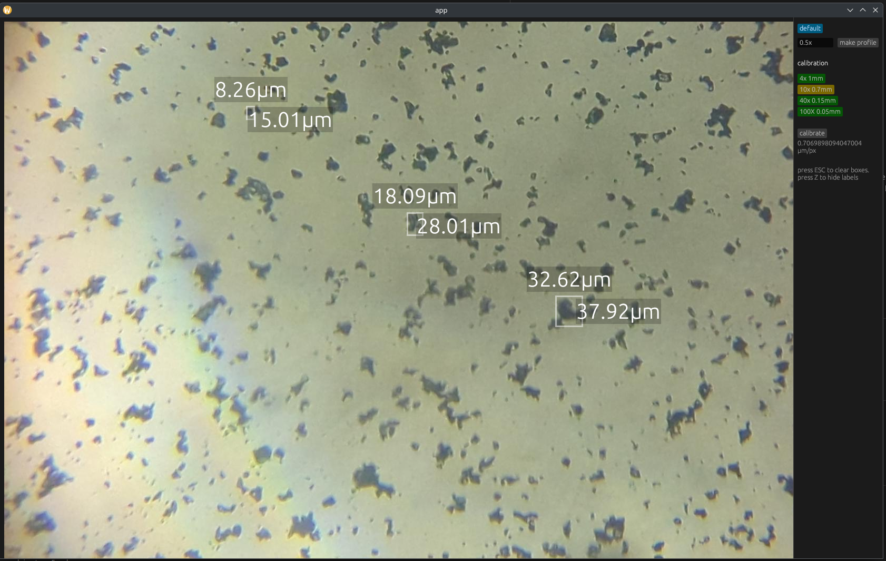
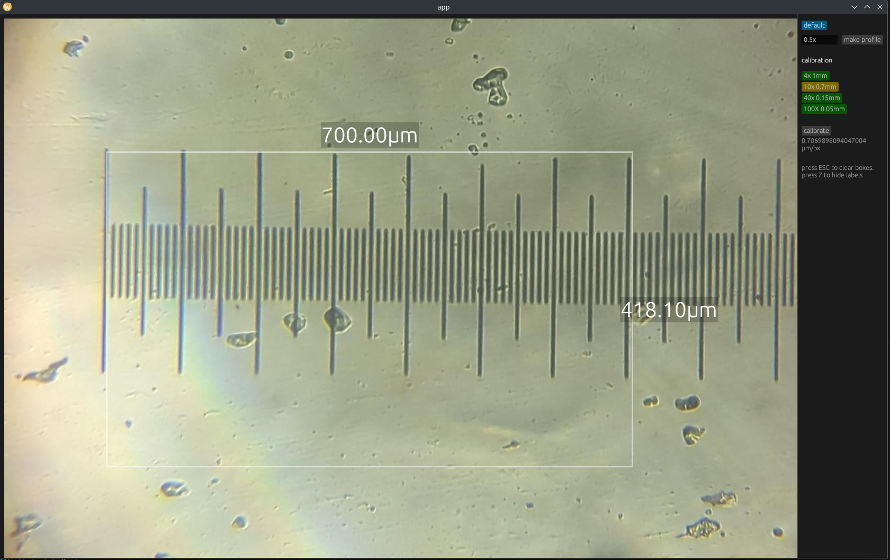
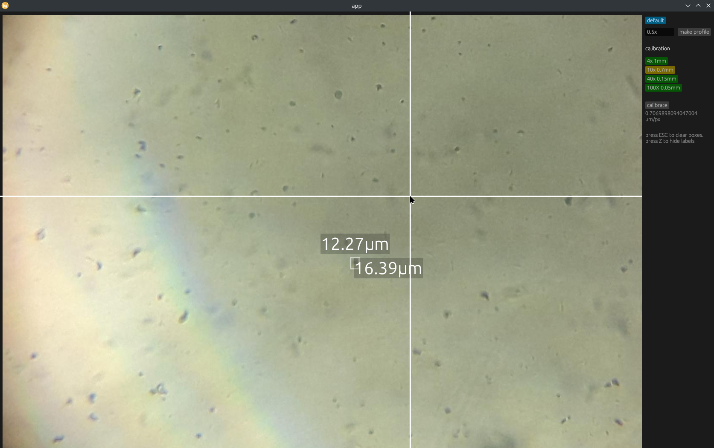

# General guide to biohacking

If you want to fix your body for any kind of reason, biohacking is welcome.

You better do it as early as possible before things happen irreversibly. 

> Is it okay to take chemical reagents?

Yes it is. Reagent companies may buy from the same production lines, or set up their own production which uses HPLC for purification. 

HPLC purification might even exceed the standard way of medicinal production, in quality. 

Such way of purification makes sure the impurities are similar in affinity to the phases. This typically implies structural similarity, and structural similarity implies similar biological effects.

It's recommended to take _potent_ drugs if you pursue this way. 

Drugs on the market are carefully designed to be highly potent and selective.

It's statistically likely that impurities are not potent, which means they are not going to cause anything that matters, given that they occupy <2% by mass, which is the usual grade of reagent purity. Nature is not smart enough to randomly generate potent toxins. Usual carcinogens are not potent. 

Just beware to not take potent toxins, such as nitrosamines.

## How do know If I can take drug X 

Toxicology follows this precedence

- Cytotoxicity
    - If you see studies on some drug causing cell death at concentration Y, take notice it means you can't have systematic exposure larger than X. 
- Enzyme assay
    - A rule of thumb of mine is that I typically ignore any drug that does not work at nanomolar level. They are useless papers. 
    - Some drugshave activity at everything at nanomolar level, which very dirty.
- Transcriptional profile
    - Drugs influence the usual expression of genes, and may produce long term effects on epigenetics. 
- Animal studies

The problems with natural drugs are, overwhelmingly,

- Unacceptably low bioavailability 
    - A lot of drugs I've seen have such problem
- Uselessly high EC50
    - They tend to be at milli molar levels.

# Raloxifene Esters for injection, Low budget synthesis tutorial

Obtain Raloxifene (freebase) directly, or through the following method.

Prepare a bi-phase-system of saturated water solution of NaHCO3 and EtAc (Ethyl Acetate).

Raloxifene-HCl 

- Off-white powder with strong red fluorecence under UV 365nm
- Poor solubility in EtAc. Forms a white suspension. 
- Excellent solubility in DMSO, and slightly worse in EtOH (Ethanol)
- Forms off white suspension in EtAc. Red fluorecence

Raloxifene

- Bright yellow powder with no fluorecence under 365nm
- Forms a suspension in EtAc
- Excellent solubility in DMSO, and slightly worse in EtOH (Ethanol)

Shake the liquid thorougly until all powder turned bright yellow, and no red fluorecence is seen.

Do not add EtOH. That would cause phases to mix.

Remove the water below by syringe.

Currently the EtAc phase contains water. Repeatedly wash the mixture to reduce the water content. 

Add an acyl chloride (here I got palmitoyl chloride) in excess. Put it on heat pad at 60C for hours, react until all powder turns off-white.

Raloxifene-dipalmitate / palmitate

- Light-yellow powder with light yellow fluorecence
- Forms milky suspension in EtAc
- It seems in EtAc the reaction produces light yellowed ester, given enough time, while reaction in 2MeTHF produces white ester. Could be raloxifene-palmitate and raloxifene-dipalmitate.

In no case should the heat pad exceed 135C. Dry heat sterilization of an oil solution of the drug is impossible as it degrades the chemical (150C for 30mins), forming brown sediment.

After the esterification, the solution contains HCl which is more than just EtAc. Acidity decreases Ralox's solubility in general.

## Preparation of the injectable

Previously I was using 50uL DMSO, 50uL EtOH, 50uL EtAc and 300uL walnut oil. It caused mild pain upon injection. 

I decided to use EtAc suspension mixed with walnut oil next time.

EtAc is known to form a stable, fine suspension with Raloxifene-dipalmitate. The oil is used to reduce hypertonicity.

There doesn't seem to be a need to make it a solution and not a suspension. DMSO injected would leach out in the body and have Ralox recrystalized anyway. 

Volume of total injectable needs to be minimized, on the order of 200uL. If there is any problem with preparing small amount of liquids, prepare a concentrated liquid and discard unused part. 

EtAc is a perfect agent for reducing viscosity in this setting, while stablizing the suspension. Experiment showed the resultant solution can pass through 30G needle, which is nearly painless by the needle. After the depot is injected, EtAc should leach out of it while the depot stays in place, which is ideal because low viscosity oily fluid increases risks of migration and embolism.

Sterilization is to be done with 0.22um PTFE filter. 

## Testing the performance of some common PTFE filter on market

The membrane filters were obtained from Aliexpress. 

Methods

- Filtration of 0.5um semi rounded TiO2 particles suspended in walnut oil. 
    - Later, with walnut oil and EtAc, which is the actual carrier.
- Direct examination of membrane under an optical microscope.

## Pharmacology and rationale

https://www.pnas.org/doi/10.1073/pnas.94.25.14105

> Indeed, it has been hypothesized that a series of ligand-dependent conformations exist and that each of these conformations may influence a unique subset of estrogen-responsive genes

> The importance of the 6-OH group is illustrated by deletion of this group (compound 1a, Table 1) or blocking as a methyl ether, (compound 1b, Table 1) each of which results in ≥100-fold decreases in both receptor affinity (0.003 and 0.008, respectively)

Theoretically, esterification of both sites should decrease binding affinity by >100x. This ensures even if Ralox-esters leach out of the depot and enters circulation, it's not active. 

A long chain ester like Raloxifene-palmitate is expected to have half life of like 30 days. 

In this reaction, all possible impurities are safe to inject, except for thermal degradation products. 

Palmitoyl chloride may generate ethyl palmitate with EtOH, palmitic acid with water, and HCl is the main esterification reaction side product which can be evaporated off.

Evaporate HCl on a watch glass. Do not overheat. I made the mistake by boiling it in a small bottle. 

Some side products cause injection site pain: acids, salts, reactive things. 

- Evaporate HCl and acyl chloride
- Neutralize acyl chloride with water, or EtOH
    - Using water can be annoying. It dissolves in EtAc and decreases the solubilizing power for esters
    - Evaporate EtOH after

In general, impurities are non-specific, usually taking a large dose to reach any harmful effect. The nice thing about potent (yet selective) drugs is that impurities are statistically unlikely to do harm.

> In men, raloxifene has been found to disinhibit the hypothalamic–pituitary–gonadal axis (HPG axis) and thereby increase total testosterone levels

This is due to antagonist effect in the brain. 

```
The distinctive SERM profile of raloxifene has been studied in
several animal models in which oestrogen agonist effects in the
skeleton and cardiovascular system and oestrogen antagonist
effects in the uterus and mammary gland were observed (Bryant
et al., 1995; Buelke-Sam et al., 1998). 

Raloxifene administration is not associated with an
increased incidence of breast pain or tenderness (Davies et al.,
1999). 
```

> The most common side-effects were hot
flushes and leg cramps. 

That's why I take a blend of Estradiol ester and Raloxifene. It's valid to blend agonists and antagonists. 

```
Raloxifene binds to the oestrogen receptor with a Kd of ~50
pmol/l, similar to 17β-oestradiol (Glasebrook et al., 1993).
Raloxifene undergoes rapid absorption, extensive first-pass
glucuronidation, and enterohepatic cycling after oral
administration. There is no evidence that raloxifene is
metabolized by cytochrome P-450 pathways. Absorption is ~60%,
with an absolute bioavailability of 2%. The time to reach average
maximum plasma concentration and bioavailability are functions
of systemic interconversion and enterohepatic cycling of
raloxifene and its glucuronide metabolites. In pharmacokinetic
and metabolic studies, raloxifene had a half-life of 27.7 h.
Raloxifene is excreted primarily in the faeces (Lilly Research
Laboratories, 1999)
```

Similar affinity, 50nM, which is _very potent_, but with longer half life. 

https://link.springer.com/article/10.1007/BF02383389

> However, raloxifene inhibited the proliferation of the human breast cancer cell line, MCF-7, with IC50=0.2 nM

Still, I see many variables in this, cell free assay, in vivo assay, IC50, Kd, data derived from cancer cell lines (they differ significantly normal cells), etc. Many results are not comparable. The situation is nuanced.

## Microcrystalline suspension of Ralox-ester

It's possible to make fine particles with EtAc precipitation, and ditch oil carrier as a whole. 

TODO: examine particle size. 

https://dailymed.nlm.nih.gov/dailymed/drugInfo.cfm?setid=199cf13e-0859-4a73-9b45-e700d0cd1049

The palmitate ester doesn't dissolve in the oil vehicle anyway. I don't see the point of using oil.

> The concentrations of medroxyprogesterone acetate decrease exponentially until they become undetectable (<100 pg/mL) between 120 to 200 days following injection. Using an unextracted radioimmunoassay procedure for the assay of medroxyprogesterone acetate in serum, the apparent half-life for medroxyprogesterone acetate following IM administration of Depo-Provera CI is approximately 50 days

```
For Depo-Provera CI vials, each mL of sterile aqueous suspension contains:

Medroxyprogesterone acetate
	
150 mg

Polyethylene glycol 3350

28.9 mg

Polysorbate 80

2.41 mg
```

TODO: check if PEG4000 can pass through filter. 

The way oil solution works is purely through oil-water partitioning so the drug continually leeches into extracellular fluid. In the same way microcrystalline solution could work. Particle sizes should influence the dynamics which is a problem.

If EtAc or any organic solvents are used, Nylon and PES membranes will be unusable.

To prevent the particles from getting into blood veseels or lymphatic system, the sizes should be around 5um to 100um. They also get taken up by macrophages, which can be a bad thing if subcutaneously injected drug gets cleared early.

To accomodate those who don't have a microscope, passing the suspension through a pore filter should remove particles that are too small, acting as a quality check at least. Particles are ok as long as they pass through 30G needle.

## Another run of Raloxifene-palmitate synthesis in 2Me-THF

The steps were repeated as above. 

Raloxifene apparently showed better solubility in 2MeTHF. An excess of palmitoyl chloride was added. 

Within an hour a milky white suspension appeared. 

Add ethanol to scanvenge the acyl chloride into ethyl palmitate. 

The suspension is a bit too stable. Add EtAC.

Still too stable. Some water was added.

I shouldn't have added EtOH. It prevented precipitation.

Neutralization of reactive agents and impurity removal should be done after the thing is dried up.

Solubility is excellent at 100C for this mixture of solvents. It formed very clear yellow solution.

Solution was left to boil at 110C. 

### Refined purification protocol

The ester powder is repeatedly washed with EtAc alone, centrifuged. Remove supernatant, add more EtAc. Pipette a drop of the supernatant onto a pH test strip. Stop when it shows neutral and powder doesn't smell. Dry it up completely on a heatpad at 80C. 

Powder must be fully dried up for precise dosing.

### Analysis of the EtAc suspension of the esters

- 3mg ralox ester, light yellow powder
- 803mg EtAc

Stable milky white suspension formed.

When the suspension is dried in air, 



The software is written by me, at https://github.com/ple1n/microscope_egui



When EtAc is not dried up, the particles are smaller and less numerous.



Goals 

- Sterilize the drug
- Form microcrystaline solution

Attempt 1, direct filtration of resultant liquid

- 10mg Ralox
- 10uL EtAc, dispersed, forming dense milky liquid.
- Add 400uL water fast.

Esters instantly precipitated. Fail.

- 10uL EtOH was added. Didnt work

Second vial

- 6.9mg Ralox ester added
- Less than 50uL Tween20
- 400uL water
- Works.
- Push it through 0.22um 
- The particles got removed. Fail.

Third vial

- 4mg Ralox added
- Yes I can filter with this solution first but this has dead volume, which is costly for, like, producing one vial for each time I use it. I prefer preparing injectables ad hoc. Less sanitation risk.
- 200uL water
- Filter. Fail. 

Probably better to keep the DMSO + oil + EtAc method.

or, filter water, and ester solution separately, and mix them in a sterile tube.

- 2mL centrifuge filtration tube. 
    - Dissolve the ester in DMSO
- Filter water with syringe filter
- Mix both, which forms a suspension.

DMSO should leech out quickly, leaving precipitate in the tissue. 

DMSO causes typical syringe piston to swell. Use syringes without rubber piston. 

## HPLC-MS analysis

Two samples were sent for analysis

1. Raloxifene-dipalmitate that was reacted in exclusively EtAc
2. Raloxifene-dipalmitate that was reacted in 2Me-THF

## Addendum: my preferred technique of injection