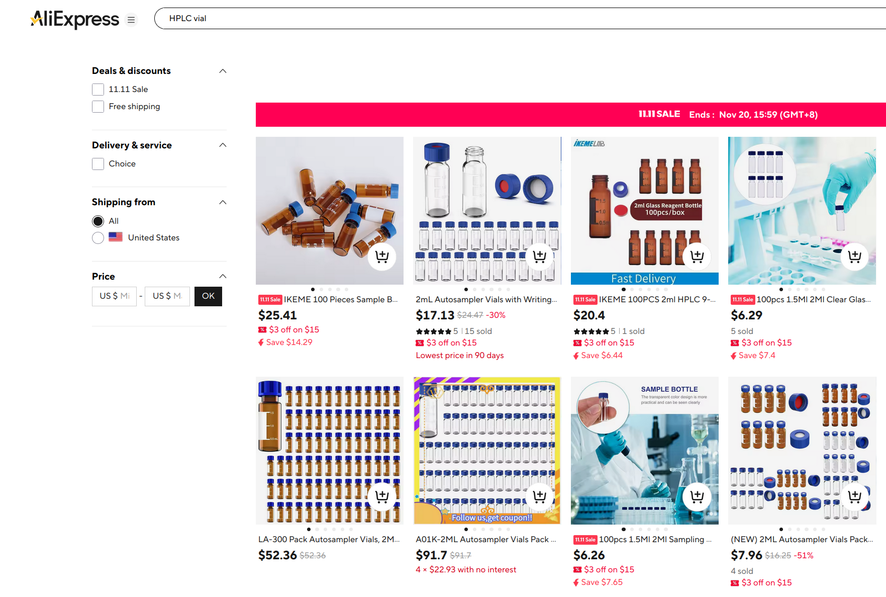
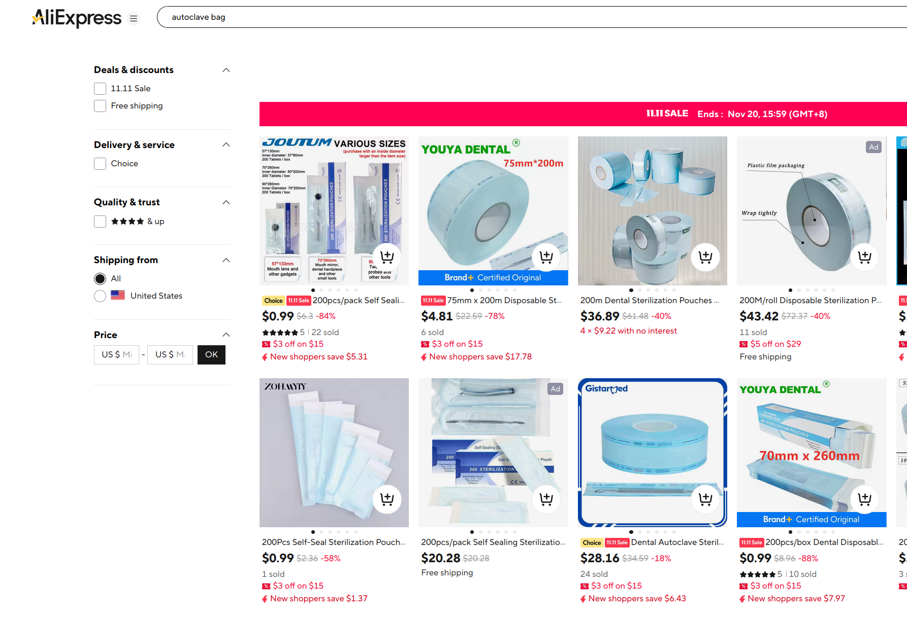
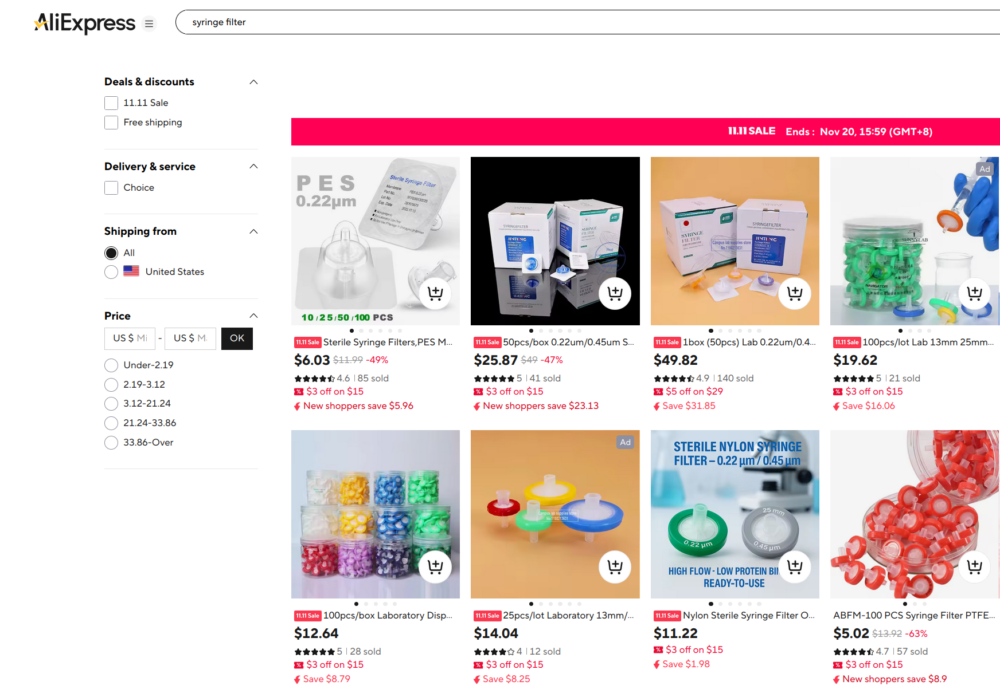
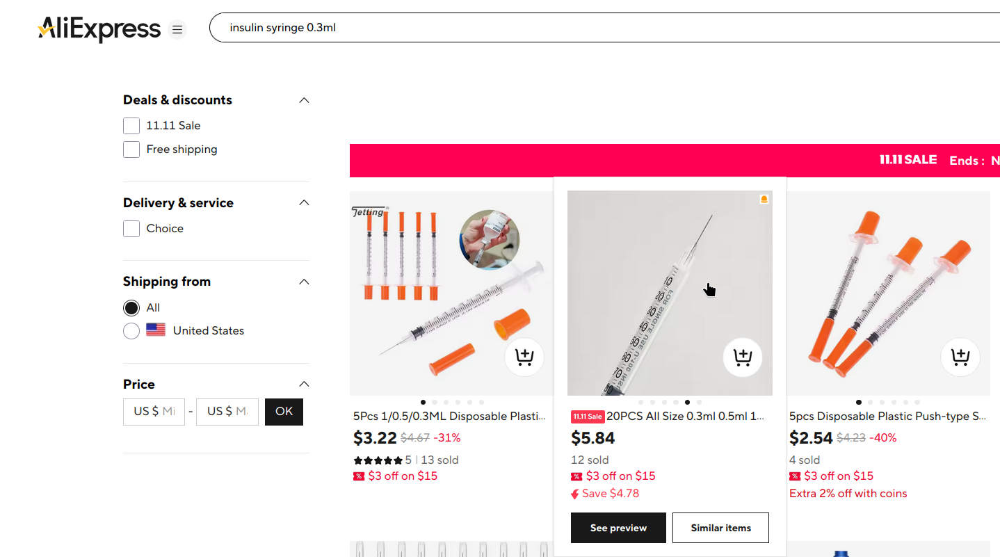

# General guide to biohacking

If you want to fix your body for any kind of reason, biohacking is welcome.

You better do it as early as possible before things happen irreversibly. It's easier to prevent things in general than to direct the body to produce phenotype in a particular way you want.

> Is it okay to take chemical reagents?

Yes it is. Reagent companies may buy from the same production lines, or set up their own production which uses HPLC for purification. HPLC purification might even exceed the standard way of medicinal production, in quality. Most people not in the field assume that chemicals are dangerous to take, whatever they are, and _assume_ that chemical analysis is very hard. The truth is that modern chemistry is almost transparent. Reaction can be live monitored with NMR. One test that determines purity of a chemical takes as little as 6USD in cost. 

Grades and these labels are only relevant to legality. Substances and purity are facts of reality on itself. I was extremely paranoid of taking research chemicals. To date I am more confident in taking a chemical produced by a legal company, than whatever is produced during frying of my food regarding health.

It's recommended to take _potent_ drugs if you pursue this way. Drugs on the market are carefully designed to be highly potent and selective. Potent drugs have better bioavailability because they require less solubility to be achieved, and cast less effect osmotically which is pronounced when you drink alcohol which is a bad drug because it needs large doses and makes you nauseaous osmotically.

It's statistically likely that impurities are not potent, which means they are not going to cause anything that matters, given that they occupy <2% by mass, which is the usual grade of reagent purity. Nature is not smart enough to randomly generate potent toxins. Usual carcinogens are not potent. 

Just beware to not take potent toxins, such as nitrosamines. Many functional groups or characteristic chemical signatures are good predictors of toxicity. Like, chlorinated chemicals tend to be hepatoxic, nitro-group-functionalized drugs tend to be [uncouplers](https://en.wikipedia.org/wiki/Uncoupler), nitrites tend to cause [methemoglobinemia](https://en.wikipedia.org/wiki/Methemoglobinemia).

You assume these rules to hold unless ample evidence against them exists in literature. General rules hold (consider them stereotypes) unless extraordinary evidence is present.

[A prompt is available for personal biomedical research](./prompt.md)

## How do know If I can take drug X 

Toxicology follows this precedence

- Cytotoxicity
    - If you see studies on some drug causing cell death at concentration Y, take notice it means you can't have systematic exposure larger than X. 
    - There is still more nuance on this, some drugs get pumped in or out by cellular transporters
    - Cytotoxicty is measured against cancer cell lines and normal cell lines such as HUVEC. Do not mistake them for each other. 
    - If a chemical is particular toxic to normal cells, you definitely can not take it.
- Enzyme assay
    - I typically ignore any drug that does not work at nanomolar or micromolar level. They are useless papers. 
    - Some drugs have activity at everything at nanomolar level, which very dirty, which is common in natural chemicals.
- Transcriptional profile
    - Drugs influence the usual expression of genes, and may produce long term effects on epigenetics. 
    - This is the more subtle part of the effects of a drug. Transcriptional changes may cause, eg. metabolic side effects.
- Animal studies
    - Long-term success in animal study can show safety in hepatoxicity, genotoxicity (non-carcinogen)

The problems with natural drugs are, overwhelmingly,

- Unacceptably low bioavailability 
    - A lot of drugs I've seen have such problem
    - They tend to have a lot of hydroxyl (-OH) groups which are easily removed by the body. 
    - Their lack of lipophilicity make them very bad drugs in general. Modern small molecule drugs follow rule of five. Most modern drugs are considered lipophilic `log P > 1`. They partition through cellular membranes until they reach active sites. Some famous drugs are actively transported, but they are exceptions, like Pregabalin, which is transported across BBB by [large amino acid transporter](https://en.wikipedia.org/wiki/Heterodimeric_amino-acid_transporter)
- Uselessly high EC50
    - They tend to be at milli molar levels.
- Almost no selectivity
    - They tend to be active for a lot of ligands and trigger a ton of transcriptional changes, which is regarded a huge failure as a drug.

You can take a drug if it passes phase 1 clinical trial, which tests for toxicity. Phase 1 trials let volunteers take the drug up to very high dose just to see if it produces toxicity.

## Misc/QA - _Optimality_

The answers are provided in all seriousness. It's a shame that modern medicine hates madness.

The solutions provided are optimal in pharmacology. The hormonal therapies have minimal side effects, such as liver toxicity. It's just the establishment sees them as too aggressive, hence rarely prescribed. I recommend against following clinicians' advice because they are braindead. 

The advice provided are all based on my experiments on myself. The causation is determined by that the past self is the control group, and the present self taking the medicine is the experimental group. In the majority of the cases, the control group remains the same so this method has value.

This is strictly not anecdotal, because I follow scientific method in determining the causes, and I am well trained in that. Chronological sampling eliminates temporary bias, but I have to acknowledge I possess inherent traits different from population average, as the only sample. 

- Anxiety
    - Pregabalin. The optimal treatment for anxiety. Tolerance develop little. For starting dose I recommend 150mg, and gradual titration to 300mg. For the first few months there are some flips in bodily reaction to the drug, during which you may experience drunkeness, stimulation, sedation. The biochemical state stabilizes after 6 months. This drug seems to be dirty afterall because it has both stimulating and sedating effects that are countering each other, which depends on the day, manifest as overall stimulating or sedating. I currently take it as a stimulant 2 days pregabalin and 2 days Atomoxetine. 
    - I have not got any response from SSRIs. 
    - Trazodone is effective when I take it. 
    - Alprazolam, which I have taken for long term, 0.2mg to 0.4mg per dose which lasts for 6 hours. Tolerance does not escalate. I suspect it caused prolong changes on my sleep architecture. 
- Motion sickness
    - I have tried many cholinergic antagonists. The best one is Scopolamine.
    - Scopolamine HCl, 0.2mg
    - Diphenhydramine, mirtazapine, etc have long half lives which make me sleepy the next day, and cause mouth driness due to their main activity as *antinicotinic*, while Scopolamine is mainly an *antimuscarinic*. `Scopolamine is generally regarded as a non-selective muscarinic receptor antagonist with an affinity ≤1 nM. At higher concentrations it also blocks nicotinic acetylcholine receptors (IC50 = 928 μM) and increases the expression of α7 nACh receptors` (1 million times selectivty)
    - `Diphenhydramine inhibits the human α7-nicotinic acetylcholine receptor (nAChR) with an estimated IC50 value of approximately 6.2 µM` while the IC50 for M1 receptor is at [100nM](https://en.wikipedia.org/wiki/Diphenhydramine) (100 times)
- Sleep induction, which causes sleepiness but does not make you _want to_ sleep
    1. Trazodone. Has good half-life parameter, which makes you not sleepy in the day. Start from 25mg. Dose not cause the very annoying mouth/throat dryness like other anti-nicotinics
        - This drug also rapidly reduces anxiety through a 5-HT pathway that is independent from SSRIs.
    2. Diphenhydramine. Good half-life parameter, short. Can casue mouth dryness.
    3. Mirtazapine. You need to take an extremely small dose so that the duration of action does not prolong into day time. The half life is inherently too long which results in a quite flat curve of metabolism.
- Acne, greasy skin and hair
    - I recommend aggressive hormonal therapy. This could have saved a lot of teenagers from disfiguring acne scars, which is non-treatable however the industry tries to convince you. Just block puberty as a whole.
    - Physical castration or chemical castration
        - Estrogen such as high dose estradiol
        - Raloxifene, as an add-on, if you don't want to grow boobs.
- Wound treatment
    - Scar may be prevented by applying _Verteporfin_ or FAK-inhibitors which act through the same pathway as the latest literature suggests. 
    - Apply [4-Butylresorcinol](https://en.wikipedia.org/wiki/4-Butylresorcinol) frequently to prevent post-wounding darkening of skin or take Tranexamic acid systematically.
- Disinfection/storage of sex toys
    - 2% NaClO solution
    - Immerse them in the solution when not in use. NaClO is cheaper compared to ethanol or H2O2 in large volume and it efficiently removes odor.
- Headache
    - It's ok to try the drug even if you are not sure it's a migraine.
    - Zolmitriptan, 2.5mg 
    - Consistently fixes the migraine, and produces a mood lift, mainly, slight ego-inflation.
    - I consider it a good short acting treatment for depression. 
    - Acetaminophen, 0.6g to 0.9g but I generally avoid it now because I do not know if that hepatoxic metabolite, although transient, would matter.
    - 2nd generation NSAIDs
        - _Celecoxib_
    - Don't be fooled by the momentum of popular choice of _Diclofenac_ and the like. Just go for 2nd gen.
- Fatigue
    - Paradoxically, I think the first treatment needed for fatigue is to exhaust energy in the day to correct sleep pattern.
        - I did this through simulants, such as pregabalin. I have to remind you again `stimulants` and `depressants` are gross categories that never capture the complete effects of a drug. When I referred to it as a stimulant, I am saying it produces an effect of wakefulness that it does and we are going for that.
    - Some drugs that I have tried. 
        - Rapamycin, almost a meme drug that has very diverse effects, including epigenetics, immune system. 
        - Allopurinol. Inhibits uric acid production when fructose is taken. UA is speculated to cause mitochondrial dysfunction follow fructose consumption.
- Adrenergic system
    - This system is connected between thyroid hormones (increases adrenergic ligand sensitivty), adrenaline, energy metabolism. 
    - Insomnia and poor sleep quality, anxiety
        - Try adrenergic antagonists (require high BBB permeability)
            - Propanolol, doses from 15mg to 20mg.
            - Carvedilol, favourable half life 7hr, but it produces some very subtle discomfort which I could somewhat notice. 
        - Because sometimes the adrenergic system goes into a state of dysregulation, manual substitution must be used
        - For many times I have problems getting into sleep because I just had too much thoughts and did not want to sleep and was going more anxious by hour. Adding more alprazolam or other benzos didn't help. This situation was only solved when I added **propanolol**, which confirms my hypothesis that the body was producing a lot of adrenergic agonists to counter the effects of benzodiazepines despite the increasing dosage.
    - Thyroxine, T4
        - On a tangent there is also https://en.wikipedia.org/wiki/Uncoupler

### Hormonal therapy

Hormones are one of the only relevant pathways of biohacking right now. They are master switches controlling a large set of downstream gene expressions. 

Medications to avoid

- Cyproterone. This drug has 100x more liver toxicity than Bicalutamide. Both are affordable enough in prices.

> Transient mild elevation in levels of liver enzymes is reported in 10–30% of patients

The drop-in alternative Bicalutamide

> Elevated liver enzymes (transaminitis) are seen in about 6% of patients, but serious liver injury is rare. Discontinuation due to liver problems is rare, occurring in approximately 1% of cases

List of possibilities I have experimented with, or propose. 

- Partial feminization therapy, _getting rid of masculinity_

Combination of SERM and estrogens can ideally achieve an androgynous phenotype, while suppressing growth of boobs. 

- Castration therapy, _a return to childhood_

Yet again, I am offering the option of doing daily _Triptorelin_ injection which can be readily obtained from research chemical suppliers. 

Triptorein has longest half life of the available GnRHs. Initially the drug is given daily; after GnRH gets desensitized, injections are given at a less frequency.

- ERβ selective estrogens. Another possible choice.

https://en.wikipedia.org/wiki/Estrogen_receptor_beta

> ERβ knockout mice show normal mammary gland development at puberty and are able to lactate normally
> This is in contrast to ERα knockout mice, in which a complete absence of mammary gland development at puberty and thereafter is observed. Administration of the selective ERβ agonist ERB-041 to immature ovariectomized female rats produced no observable effects in the mammary glands

### Triptorelin, the castration drug

Triptorelin acetate at 0.1mg, daily. https://www.ferring.ca/media/1394/decapeptyl-01-mg-pm_control-no-291110-en_04mar2025.pdf

The drug was bought as a reagent. Theoretically it's possible to to have a GnRH agonist with half life longer than Triptorelin (around 6 hrs), like a week.

Use normal saline or PBS buffer to make the solution. I always used pure water for the fear of going hypertonic, which ended up giving me 'stings'.

The drug dissolved well in pure water, surprisingly. But next time I will use PBS or normal saline.

I recommend using insullin syringes of 0.3mL when injecting, to minimize dead volume. 

If your initial volume of liquid is very small you can use centrifuge filter. Syringe filters have 0.5mL dead volume.

I have tried this drug. It did work when I injected it daily, but its too labourious to inject the drug daily although it was not painful at all.

### Tirzepatide, the weight loss drug

I bought this as a reagent as usual, for 10x cost saving.

It worked. Tirzepatide (provided as acetate salt I think) has high solubility in PBS, which is sorta unexpected because most drugs I have tried to formulate or dissovle tend to dissolve poorly, especially in water, and sometimes organic solvents fail too. 

### Topical drugs, the preparation

Here is a guide to low budget, low volume preparation of topical drugs. 

1. Determine the EC50, IC50, Ki of your drug

The minimal concentration can be calculated from EC50, but as much as the budget allows, feel free to escalate the concentration 1000X or 100000x. Much higher concentration is needed to faciliate quick enough transport of the drug into cellular medium. 

2. Solubility study

Drugs tend to have solubility problems. 

- Vegetable oil as the vehicle
- Aqueous formulation, with gelling agent, or as an emulsion with oil
    - Note that gels can have problem passing syringe filters, which in wound treating topical formulations, is required.

I tend to use vegetable oil based formulation now. 

Disperse the drug in a solvent such as DMSO, or ethanol, or ethyl acetate. The drug need not be completely dissolved. In that case it forms a micro-crystalline suspension in the oil.

To solubilize anything in oil, usually you need high temperature, eg. 100C to make the dissolution fast enough. 

## Under-justified fear of drugs

I'm talking about long-term usage of _non-psychoactive drugs_ in general. Most believe that all drugs come with some harm, so they should be avoided at all cost. 

The point being humans are born imperfect, as everyone is a bag of randomly chosen traits, differentially expressed genes etc. Perfection, must be reached with intense drugging.

Modern drugs are of precision, which means as a matter of fact they do not come with unexpected side effects. A drug is completely determined by its profile on enzyme inhibition, ligand interaction with receptors, influence on transcriptional activity and other epigenetic mechanisms.

In 99.9% of cases, it's ok and better to combine multiple drugs. The body is a pool of an enormous variety of chemicals. 

It's better to take drugs before your diseases develop irreversibly, such as obesity, formation of a scar, etc. While I write about biohacking and methods here, I am well aware of the bounds of present biochemistry. There are too many things that can not be done.

## Advent of poly-drug therapy

The body is a soup of hundreds of millions chemicals and the processes. 

That it is better not to combine drugs is a commonly assumed principle.

It has its merits because single-drug therapy is more predictable and follows well studied trajectories. 

But it's not a stretch to base on the studies to predict the prospect of combined therapies well. 

- Most drugs do not interact each other, unless otherwise specified in the label and literature. 
    They don't interact because they are _not_ reactive chemical specicies like what's used in industrial chemical synthesis. 
- Liver enzyme-based interaction is the most common one (and usually adverse), and easy to spot. 
- Ligand-binding is the focal point of the interaction you'd be interested in. 

# Preparation, methods

I have a milligram lab scale which measures drug up to 0.1mg, but for an even lower cost setup, you can try a typical resistor scale. 


These things might work, as long as you test them with a standard weight. 


All you need is repeatability, buy the 1mg and 10mg versions. These 2 are the most commonly used masses.

There are automated capsule fillters on the market too


I know these are produced in China. Search for the vendors yourself. 

## Batch preparation of gelcaps

```julia
using DynamicQuantities.SymbolicUnits;
using DynamicQuantities;

function calc_cut(dose = 2.5us"mg")
    pill_type_0 = 300us"mg"
    pill_num = 24
    m_all = pill_num * pill_type_0
    m_dye = m_all * conc_chlorophyl
    drug_all = dose * pill_num
    filler = pill_type_0 * pill_num - drug_all - m_dye
    @show drug_all, m_dye, filler, m_all
end
```

I use Julia notebook on nightly to do all calculation.

### Solid dispersant system

- I have batch capsule makers that make capsules of 300mg powder
- Drugs tend to need 2.5mg in mass
- Candidate solid dispersants
    - Microcrystalline cellulose (currently in use)
    - Resistant starch

Steps

- The drug powder is first mixed with a dye marker
    - such as Chlorophyll Copper salt
    - this assumes that the drug powder moves in approximately same way when its mixed with the dispersant.
- The vessel is shaken to visible endpoint.

## Preparation of solution



I always use this kind of vials for keeping solutions. 

You can sterilize them by putting them in a membrane bag, and autoclaving.



Solutions can be filtered with `0.22um` syringe filters to reach good enough sterility. A little bit mirobiota won't hurt you. Remember, everything in the body, follows the Pareto principle, that drugs only start having effects after a threshold which is a marked change, that toxins only have an effect when they deplete your Glutathione storage for example (as in Acetaminophen overdose). It's the same for microbiota contamination. 



Syringe filtration setup has 50uL dead volume, which can be a concern if you value your drug. 

Dissolving drugs is actually hard. 

For aqueous solutions of chemicals, I recommend cyclodextrins such as HP-beta-cyclodextrin, and poloxamer F127. Out of all solvating methods I have tried, cyclodextrins are most remarkable. They are biocompatible and solvates most common drugs which are lipophilic. Co-solvent system with DMSO also works. 

Oil solutions may also be desired if you want to do an injection depot or topical application. In this case, you can use DMSO to enhance solvating power, and ethyl acetate to reduce viscosity if thats needed. Usually, dissolve the drug in a bit of DMSO first, with gentle heat, and add the oil base. 

For injectable depot, I recommend 'fractionated coconut oil' which consists of medium-length triglycerides. It can pass through 31G needles. Many drugs can be formulated as depot drugs due to their high logP value, which is in fact better than the oral route, because the oral route passes through liver and first-pass metabolism often triggers many adverse effects. 

Some drugs require metabolic activation, which is known as prodrugs, some drugs do not. Some drugs have active metabolites and some do not.

For peptides and such low viscosity fluids, I use insulin syringes for injection. They have close to 0 dead volume which saves money. 



Formulate your drug such that each dose requires 0.2mL volume injected, if possible.